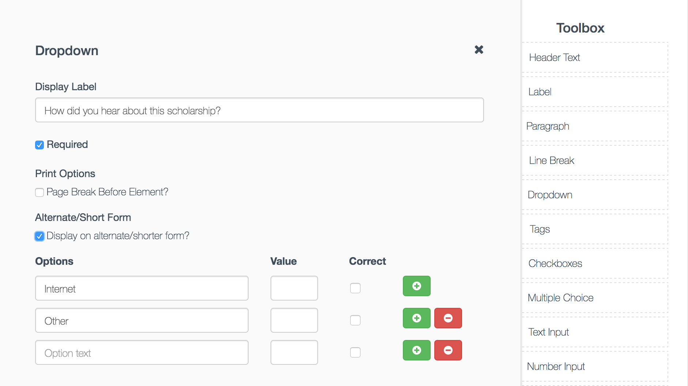

# From Builder
A complete react form builder that interfaces with a json endpoint to load and save generated forms.
- Upgraded to React 16.8.6
- Bootstrap 4.x, Font-Awesome 5.x
- Use react-dnd for Drag & Drop
- Save form data with dummy api server
- Show posted data on readonly form
- Multi column row


### Editing Items


# Basic usage
### Start server locally
```bash
$ npm start
```
# Tests
```bash
$ npm test
```
